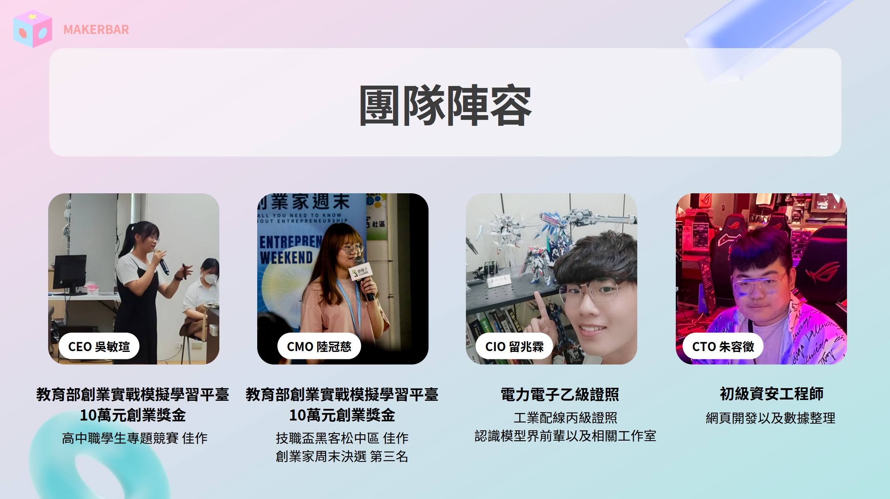
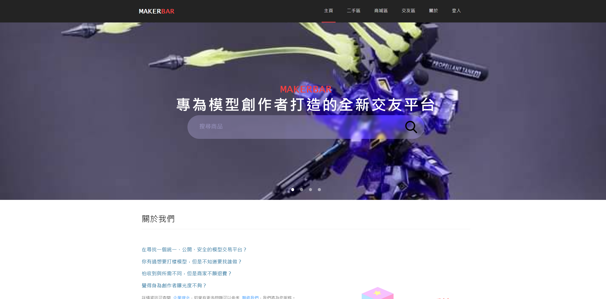
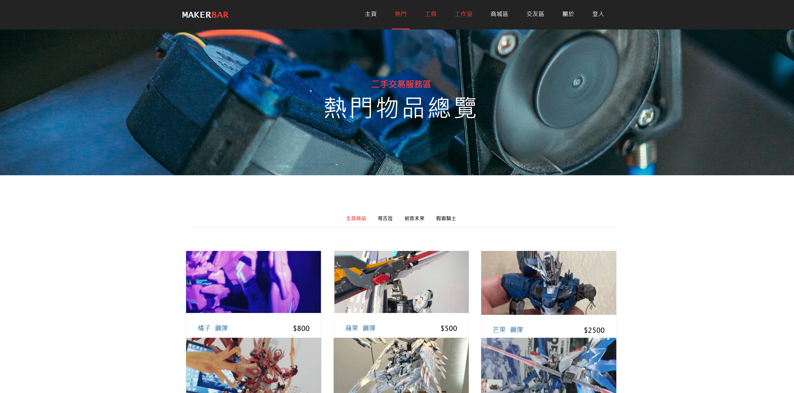
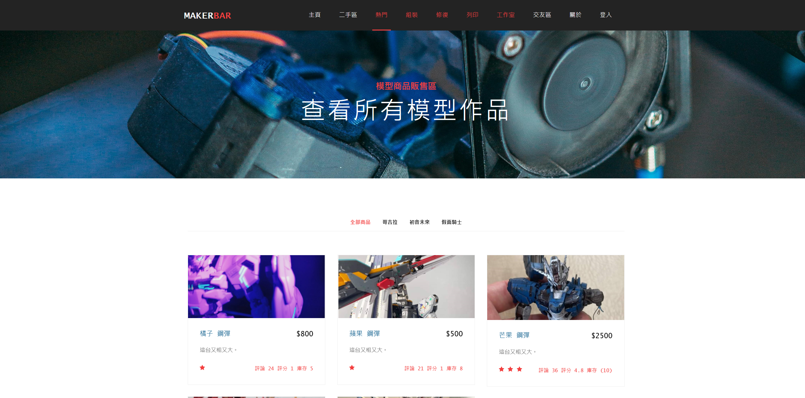
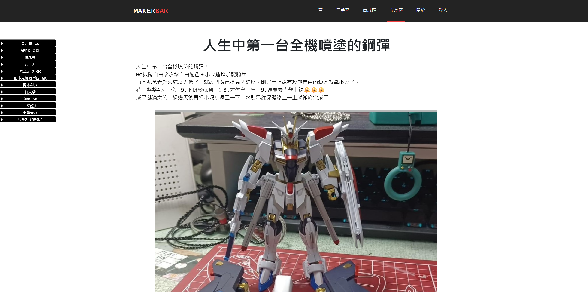
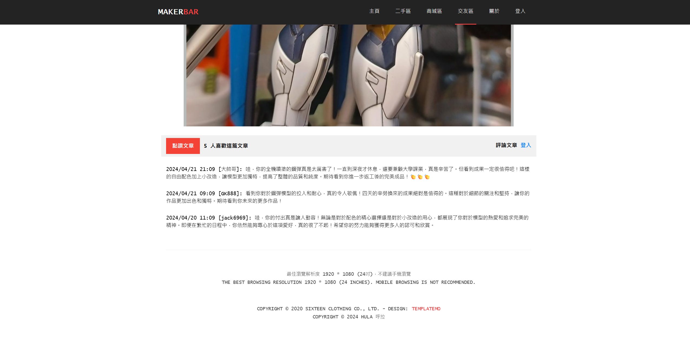
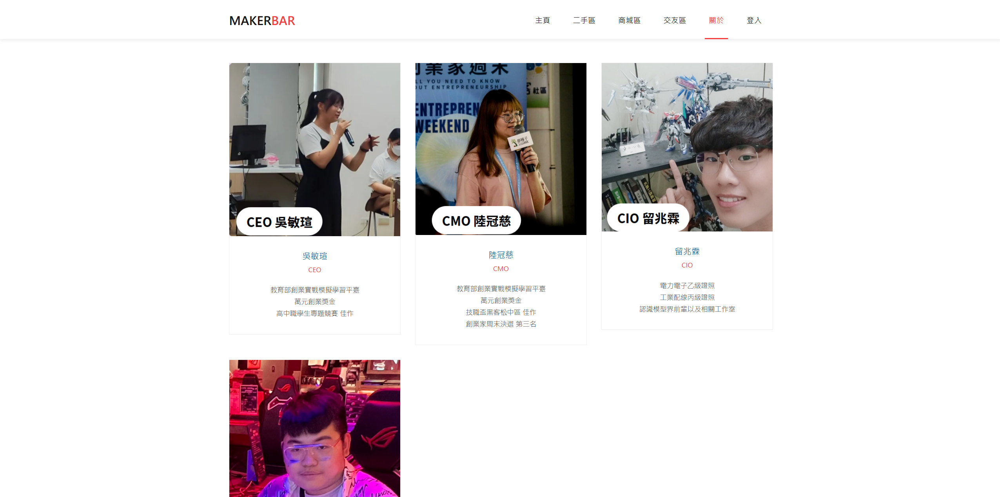
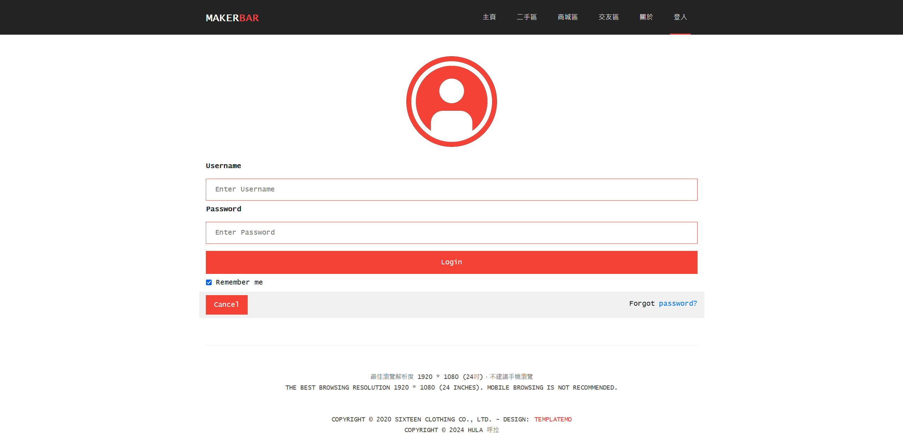

# 2024 第 7 屆致青春創未來全國選拔大賽 參賽作品

# MakerBar
#### 專為模型者創造的商品和交友平台

- #### 團隊資訊

    - #### 團隊名稱：Hula呼拉

    - #### 作品名稱：MAKERBAR

    - #### 作品動機  
    缺乏數位服務，由於在社團上，在模型新資訊上沒辦法做出整理，以及創作者代工的部份通常只有私人訊息的紀錄，有時候訂單太多會忘記，沒辦法有個簡單的系統去紀錄訂單的進度。  
    >
    創作者們沒有機會去認識彼此，我自己本身是一名模型創作者，認識其他創作者就必須透過模型店或是FB社團，又或者是朋友介紹，才能認識到創作者，學習到更多不一樣的製作技巧。  
    >
    MakerBar 提供創作者們及個人使用者一個平台，創作者們可以把自己的產品放在平台上，使用者可以在平台上尋找自己喜歡的模型，並進行購買，或是與創作者溝通自己的需求，再請創作者進行製作，個人使用者下單後，進行付款，創作者交付完訂單，平台在進行撥款，類似於第三方支付的概念，訂單完成後進行抽成，每筆訂單抽成7.5%運費不列入計算，再來是廣告商的部分，廣告進駐我們平台，支付廣告費。  

    - #### 團隊成員

  

- ## 範例圖片
> 最佳瀏覽解析度 1920 * 1080 (24吋)，不建議手機瀏覽。  
> 範例圖片皆為 2k 解析。  

- ## 範例資源
    - [簡報檢視](https://www.canva.com/design/DAGA_mzdvB0/CUQugH4grUnEvFZ82dcwuw/view?utm_content=DAGA_mzdvB0&utm_campaign=designshare&utm_medium=link&utm_source=editor)
        - rel: [***https://www.canva.com/design/DAGA_mzdvB0/CUQugH4grUnEvFZ82dcwuw/view?utm_content=DAGA_mzdvB0&utm_campaign=designshare&utm_medium=link&utm_source=editor***](https://www.canva.com/design/DAGA_mzdvB0/CUQugH4grUnEvFZ82dcwuw/view?utm_content=DAGA_mzdvB0&utm_campaign=designshare&utm_medium=link&utm_source=editor)

---

## 目錄
- [目錄](#目錄)
- [開發環境](#開發環境)
- [如何執行](#如何執行)
- [版本差異](#版本差異)
- [日誌](#日誌)
- [貢獻](#貢獻)
- [著作權](#著作權)

---

## 開發環境

- Windows Home 10 64bit
- Chrome Version 114.0.5735.199 (Official Build) (64-bit)

---

## 如何執行

> 預設 ***Windows Home 10 64bit*** 作業系統  

- 方法一：直接點兩下執行 `index.html`

- 方法二：點擊[網頁連結](https://zongzong0408.github.io/MakerBar)，在網路公開觀看
    - rel: [***https://zongzong0408.github.io/MakerBar***](https://zongzong0408.github.io/MakerBar)

## 版本差異

| 版本 | 描述 |
| :--: | ---- |
| v1.0 | 現階段已完成。 |

## 日誌

| 時間 | 事件 |
| :--: | ---- |
| 2024/04/20 | 完成。 |

## 貢獻

此作品網頁部分為我全權處理，文書和報名資料皆其餘組員分配處理。
由於時間限制，網頁模板參考[***TemplateMo***](https://templatemo.com)。

## 著作權

此專案受到 [GPL-3.0](https://www.gnu.org/licenses/gpl-3.0.zh-tw.html) 保障。  
Copyright © 2024 zong zong ( zongzong0408 )
Copyright © 2020 Sixteen Clothing Co., Ltd. - Design: TemplateMo
